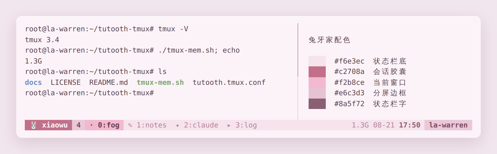

# 🐰 tmux-tutou

一套奶油粉色的 tmux 主题。奶油底、莓粉字，左下角一只兔头衔着会话名。

原本是 2026-07-31 给家里那台服务器搓的，用了大半个月，回头看它比市面上那些「终端就该是黑的」顺眼太多，所以拿出来。



## 装

```sh
curl -o ~/.tmux.conf   https://raw.githubusercontent.com/Anko3o/tmux-tutou/main/tutooth.tmux.conf
curl -o ~/.tmux-mem.sh https://raw.githubusercontent.com/Anko3o/tmux-tutou/main/tmux-mem.sh
chmod +x ~/.tmux-mem.sh
tmux source-file ~/.tmux.conf
```

已经有自己的 `.tmux.conf` 的话，把内容追加进去就行，本主题**不改任何按键绑定**。

`tmux-mem.sh` 是状态栏右边那格可用内存的取数脚本，不想要就把 `status-right` 里的 `#(...)` 删掉，其余照常工作。

## 状态栏上有什么

```
 🐰 xiaowu  3 │ ✦ 2:claude  · 0:bash │        2.0G  08-21 17:27  la-warren
```

- **兔头后面的数字** = 这只会话开着几个窗口。数字变大而你没印象，多半是有窗口用完忘了关。
- **窗口标签前的小记号** = 这一格里跑着什么：
  `✦` claude ／ `✎` vim、nano ／ `▸` 其他命令 ／ `·` 空着的 shell。
  全部是单宽字符，手机终端和网页终端都不掉字、不错位。
- **右边第一格** = 可用内存。掉到 800M 以下时前面多一颗 `●`。

## 配色

| 用处 | 色值 |
| --- | --- |
| 状态栏底 | `#f6e3ec` 奶油粉 |
| 状态栏字 | `#8a5f72` 莓灰 |
| 会话名胶囊 | `#c2708a` 深莓 / 字 `#fff6fa` |
| 当前窗口 | `#f2b8ce` 粉底 / 字 `#6b3a4e` |
| 其他窗口 | `#b3849a` 淡莓 |
| 分屏边框 | `#e6c3d3`，选中的那格 `#c2708a` |

真彩色是靠 `terminal-overrides ",*256col*:Tc"` 开的。不开这一行，粉色会被降级成 256 色里最接近的那个，看着发土。

## 三条不是配色的设置

```
setw -g aggressive-resize on
set -g history-limit 50000
set -g renumber-windows on
```

- **aggressive-resize**：同一只会话同时挂着两个客户端（比如手机 Termux + 网页终端）时，tmux 会按最小的那个宽度重画。宽度对不上就会出现「打了一个字，整句被复制一份贴在后面」的错位。开了这条，窗口只跟着真正在看它的那个客户端调整。
- **history-limit 50000**：回滚缓冲，刷屏之后还能翻回去。
- **renumber-windows on**：关掉中间某个窗口后编号自动补齐，不留空号。

## 一条故意没开的

```
# set -g mouse on
```

注释掉的，不是漏了。开了鼠标模式之后，鼠标拖选会被 tmux 接管，系统级的「拖蓝→复制」就没了。实测过一次，复制不了字比能用滚轮难受得多。想要就自己解开。

## License

MIT
